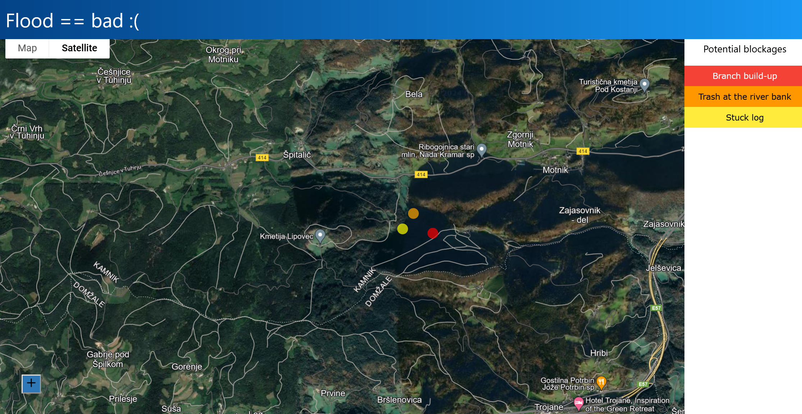
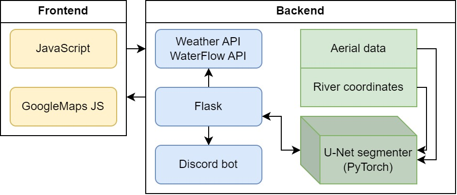

# Dragonhack 2024

Hi, we are team Takle mamo. Our Dragonhack 2024 product is a web application called FLOOD = BAD. It's meant to be used by the Slovenian government and water management agencies, in order to help prevent disastrous floods like the ones that happened in Summer/Fall 2023.

Slovenia is among the countries in Europe with the most aquatic resources. Because of that, it's crucial to keep an overview of the potential water infrastructure maintenance needs. Not taking care of water infrastructure drastically increases the flooding risk of the area. Our tool helps the responsible parties identify and pay attention specifically to the places that are at risk.

The tool utilizes computer vision on the aerial photos of the Slovenian waters, particularly rivers. It analyses the potential blockages that could cause water flow obstructions. We hope that the tool can raise accountability and awareness of the importance of the maintenance of our water bodies.

# User Experience

The main part of the user experience is a map interface of Slovenia, on which there are several colorful markers that mark a potential blockage and its severity. The respective marker colors mark the predicted severity of the blockage, with yellow being the lowest and red the highest.

On the right side of the screen, there is a navigation bar to help the user locate each individual marker. Upon clicking on the marker on the menu, the marker gets placed in the user's viewpoint on the map and if the user clicks on the marker itself, the marker's name shows up and the user view on the map gets zoomed in around the marker.  

# Architecture

